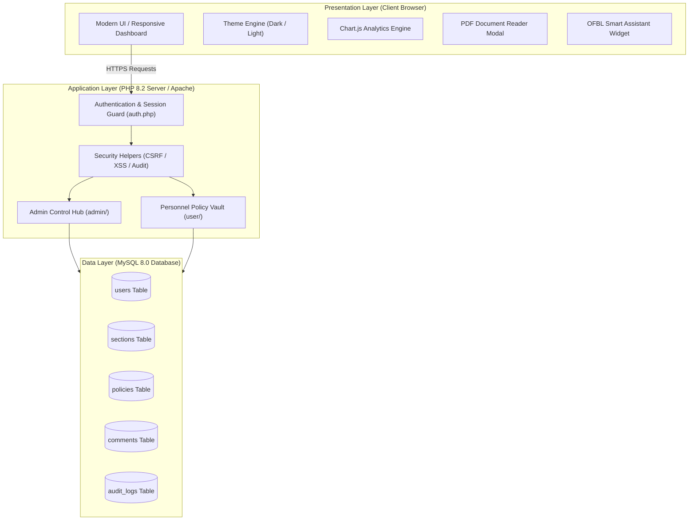
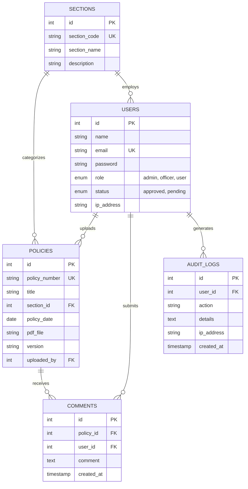

# 🛡️ OFBL Policy Governance System (Enterprise Edition)
### *Digital Vault & Compliance Directives Management Platform*
**Ordnance Factory Badmal (OFBL) &bull; Munitions India Limited (MIL) &bull; Ministry of Defence, Government of India**

[](https://shreyas-sahu.github.io/ofbl-policy-system/)
[](https://www.php.net/)
[](https://www.mysql.com/)
[](https://www.docker.com/)
[](#-security--compliance-architecture)
[](LICENSE)

---

## 🏛️ Executive Summary

The **OFBL Policy Management System** is a secure, defence-grade digital vault engineered to replace legacy paper-based notice boards and manual records with a centralized, role-governed document distribution platform.

Developed during an official engineering internship at **Ordnance Factory Badmal (OFBL)**, a premier ammunition and armaments production unit of **Munitions India Limited (MIL)** under the Department of Defence Production, **Ministry of Defence, Government of India**.

### 👨‍💻 Project Authorship & Institutional Credentials
- **Lead Architect & Developer:** **Shreyas Sankalp Sahu** (Reg No. 2405840)
- **Academic Program:** B.Tech Computer Science & Engineering (2nd Year / 4th Sem), **KIIT Deemed to be University**, Bhubaneswar
- **Institutional Mentors & Supervisors:**
  - **Smt. Minati Pradhan**, JWM / Information Technology Centre (ITC)
  - **Shri Trinatha Behera**, Senior Manager / Human Resource Development (HRD)
  - **Shri M.S Naik**, Officer-in-Charge / HRD
- **Internship Period:** 04/05/2026 to 06/06/2026 &bull; Ordnance Factory, Badmal

---

## ⚡ Live Demonstration & Dual Deployment

This repository is uniquely engineered for **dual-mode deployment**:
1. **GitHub Pages Live Demo (`index.html`)**: Run a 100% interactive, client-side simulated version directly in any web browser without needing a backend server! Allows instant testing of both Administrator and Personnel views, department analytics, PDF previews, live comments, search, and AI assistant.
2. **Enterprise PHP 8+ & MySQL Backend (`index.php`, `admin/`, `user/`, `database.sql`)**: Production-hardened server implementation featuring prepared statements, CSRF tokens, session timeouts, and Docker orchestration.

---

## 🚀 Key System Features

### 👑 1. Administrator Executive Hub
- **Executive Metric Cards**: Real-time KPI counters tracking active policies, registered personnel, factory divisions, and active discussions.
- **Departmental Analytics**: Live Chart.js Doughnut Chart visualizing directive distribution across production bays and administrative centres.
- **Clearance Queue & Approval Workflow**: Administrative approval gate where newly registered employees remain `pending` until authorized.
- **Directive Management**: Author, publish, update, and categorize policy documents with revision versioning (`v1.0`, `v2.1`).
- **Factory Sections Manager**: Dynamic administration of factory divisions (ITC, Production, DGQA, Safety, Finance, HRD).
- **Defence-Grade Audit Trail**: Automated real-time logging of authentication, document publishing, approvals, and deletions with client IP and timestamps.

### 👤 2. Personnel Policy Vault
- **Departmental Filtering**: Quick filter chips to isolate directives by bay (ITC, Safety & Explosives, Production, DGQA Quality, HRD & Ethics).
- **Instant Search**: Real-time keyword filtering across policy numbers, titles, and executive hints.
- **In-Browser PDF Preview Modal**: Secure embedded reader allowing personnel to inspect directives directly within the application.
- **Discussion & Query Streams**: Interactive collaboration thread per directive enabling employees to seek clarifications on compliance protocols.
- **Smart OFBL Policy AI Bot**: Floating interactive assistant with pre-configured knowledge retrieval for common factory procedures.

---

## 🔒 Security & Compliance Architecture

| Security Domain | Implementation Standard | Defence Benefit |
| :--- | :--- | :--- |
| **SQL Injection (SQLi)** | Parameterized Prepared Statements (`mysqli_stmt` / PDO) | Eliminates database manipulation vectors across all endpoints. |
| **Authentication** | Cryptographic Bcrypt Hashing (`password_hash()`) | Irreversible salted hash storage with zero plain-text passwords. |
| **Cross-Site Request Forgery (CSRF)** | Cryptographic Anti-CSRF Tokens (`verify_csrf()`) | Prevents unauthorized cross-origin state changes. |
| **Cross-Site Scripting (XSS)** | Universal Output Encoding (`htmlspecialchars()`) | Neutralizes malicious script execution in discussion threads. |
| **Session Security** | 30-Min Inactivity Auto-Logout (`$_SESSION['LAST_ACTIVITY'] > 1800`) | Mitigates unattended terminal hijacking on the factory floor. |
| **Session Fixation** | ID Regeneration (`session_regenerate_id(true)`) | Generates fresh cryptographic session identifiers upon login. |
| **File Upload Hardening** | Extension whitelist (`.pdf` only), MIME verification, `.htaccess` execution ban | Blocks executable scripts or web shells from running in upload folders. |

---

## 📐 System Architecture



---

## 🗄️ Relational Database Schema (ER Model)



---

## 🛠️ Quickstart Guide

### Option 1: 1-Click Docker Launch (Recommended)
Clone the repository and spin up the complete containerized stack:
```bash
git clone https://github.com/your-username/ofbl-policy-system.git
cd ofbl-policy-system
docker compose up -d
```
- Open your browser at: `http://localhost:8080`
- MySQL port forwarded to: `localhost:3307`

---

### Option 2: Traditional Local Server (XAMPP / WampServer)
1. Clone or copy the folder into your web server root (e.g. `C:\xampp\htdocs\ofbl-policy-system`).
2. Start **Apache** and **MySQL** in XAMPP Control Panel.
3. Open your browser and run the automated database setup:
   ```
   http://localhost/ofbl-policy-system/install.php
   ```
   Click **"Run 1-Click Database Setup"** to automatically create `ofb_policy_db` and seed all tables.
4. Access the portal at: `http://localhost/ofbl-policy-system/`

---

## 🔑 Default Test Credentials

| Role | Email Address | Password | Clearance Level |
| :--- | :--- | :--- | :--- |
| **👑 System Administrator** | `admin@ofbl.gov.in` | `Admin@OFBL2026!` | Level 1: Full Control & Audit |
| **👤 Production Personnel** | `rajesh.sharma@ofbl.gov.in` | `User@OFBL2026!` | Level 2: Policy Vault & Discussion |
| **👤 Safety Officer** | `pooja.verma@ofbl.gov.in` | `User@OFBL2026!` | Level 2: Policy Vault & Discussion |
| **⏳ Pending Trainee** | `alok.mohanty@ofbl.gov.in` | `User@OFBL2026!` | Pending Clearance Approval |

*(Note: The login page also includes 1-click credential auto-fill buttons for evaluator convenience.)*

---

## 📂 Project Structure

```
ofbl-policy-system/
├── .github/
│   └── workflows/
│       └── ci.yml             # GitHub Actions CI validation workflow
├── admin/                     # Administrator Module
│   ├── dashboard.php          # Executive analytics dashboard
│   ├── manage_policies.php    # Policy repository management
│   ├── upload_policy.php      # Secure directive uploader
│   ├── edit_policy.php        # Policy editor
│   ├── sections.php           # Department administration
│   ├── users.php              # Clearance queue & user directory
│   └── comments.php           # Feedback & inquiry moderation
├── assets/
│   ├── css/
│   │   └── admin.css          # Enterprise design tokens & styling
│   └── js/
│       ├── chart.js           # Chart.js v4.5 engine
│       └── portal-store.js    # Client-side data store for GitHub Pages demo
├── includes/                  # Core Security & Helper Libraries
│   ├── auth.php               # Session security & 30-min auto-logout
│   └── helpers.php            # XSS sanitizers, CSRF validation, audit logging
├── uploads/
│   ├── .htaccess              # Apache hardening against script execution
│   ├── pdfs/                  # Official policy directive PDF documents
│   └── profile/               # Personnel avatars
├── user/                      # Personnel Module
│   ├── dashboard.php          # Policy vault with inline PDF reader
│   ├── profile.php            # User identity & clearance credentials
│   ├── about.php              # Institutional overview & authorship credits
│   └── change_password.php    # Cryptographic password update
├── database.sql               # Complete relational MySQL schema & seed data
├── db.php                     # Central database connection
├── docker-compose.yml         # Containerized development & deployment
├── Dockerfile                 # PHP 8.2 Apache container configuration
├── forgot_password.php        # Self-service password recovery
├── index.html                 # GitHub Pages Live Interactive Demonstration
├── index.php                  # Secure Portal Authentication Gateway
├── install.php                # 1-Click Database Setup & Migrator Utility
├── LICENSE                    # MIT Open Source License
└── README.md                  # Project Documentation
```

---

## 📜 Acknowledgments

Special gratitude to the leadership and technical staff at **Ordnance Factory Badmal (OFBL)** and **Munitions India Limited (MIL)** for their guidance, domain expertise, and mentorship during this training period.

&copy; 2026 **Shreyas Sankalp Sahu** &bull; Ordnance Factory Badmal, Munitions India Limited, Ministry of Defence, Government of India.
